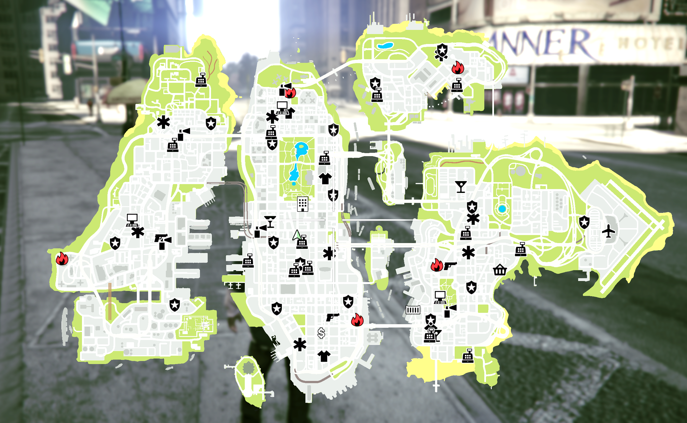

# Liberty_City_Emergency_Map_Blips - v1.1.0
Standalone Script Created By - DodgergamingJR

# Five M Version 

## Features
* All Police Stations
* All Hospitals
* All Fire Stations
* All Garages


## Installation

- Download the script and put it in your fivem resources directory.
- Add the following code to your server.cfg/resouces.cfg

```
ensure Liberty_City_Emergency_Map_Blips
```

## Configuration

There's a config file to add or remove Blips

## Example


## Credits

* [Mehdi-MMO mmo-smallresources](https://github.com/Mehdi-MMO/mmo-smallresources) - Based On This Script


# Singleplayer Version 

## Installation

- Download the Scripthook and ScriptHookVDotNet
- Create a Script Folder in your GTA V Directory
- Place Files Inside Script Folder

## Configuration

- There's a config file to add or remove Blips by Setting True/False

- Police_Station_Blips = true
- Hospital_Blips = true
- Fire_Station_Blips = true

## Example


## To Do
- Replace "Hot Property" Name with "Firestation"

## Changelog
- v1.0.0 - Five M 
- v1.1.0 - Singleplayer Added