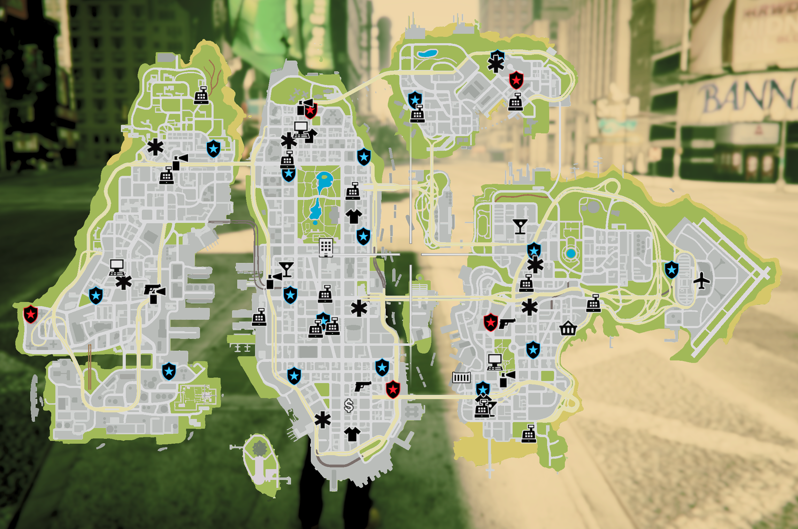

# Liberty_City_Emergency_Map_Blips - v1.2.0
Standalone Script Created By - DodgergamingJR

# Five M Version 

## Features
* All Police Stations
* All Hospitals
* All Fire Stations
* All Garages


## Installation

- Download the script and put it in your fivem resources directory.
- Add the following code to your server.cfg/resouces.cfg

```
ensure Liberty_City_Emergency_Map_Blips
```

## Configuration

There's a config file to add or remove Blips

## Example


## Credits

* [Mehdi-MMO mmo-smallresources](https://github.com/Mehdi-MMO/mmo-smallresources) - Based On This Script


# Singleplayer Version 

## Installation Automatically - OIV [RECOMMENDED NIGHTLY BUILD]

- Download the ScripthookV and All ScriptHookVDotNet Nightly Files from [ScriptHookV](http://www.dev-c.com/gtav/scripthookv/) and [ScriptHookVDotNet](https://github.com/scripthookvdotnet/scripthookvdotnet-nightly/releases/tag/v3.7.0-nightly.13).

- Download Zip
- Unzip File
- Launch OpenIV - Click Open Package Installer
- Go to directory where the unzipped download is
- Open Folder Of Singleplayer
- Open Automatic Installation - OIV Folder
- Open the OIV File
- Click Install
- Make sure to select location to install as the "game" folder
- Once Installed Successfully close Package installer window
- Launch GTA V

## Installation Manual

- Download the Scripthook and ScriptHookVDotNet Nightly
- Drag Script folder inside of GTA V directory

## Configuration - EmergencyBlips.ini

- There's a config file to : 

- add or remove Blips by Setting True/False

- Police_Station_Blips = true
- Hospital_Blips = true
- Fire_Station_Blips = true


- Change Icon Color

- PoliceBlipColor = Blue 						
- HospitalBlipColor = White 				
- FireBlipColor = Red


## Example


## To Do

## Change_log
- v1.0.0 - Five M 
- v1.1.0 - Singleplayer Added
- v1.1.1 - Singleplayer Automatic OIV File Added
- v1.2.0 - Singleplayer Redone as Nightly Build + Fixed Fire Station Name for Nightly Build